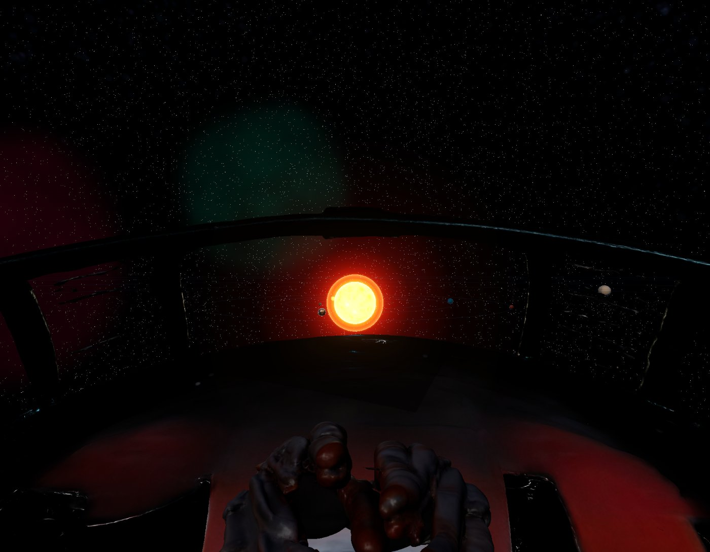

# GOD-SIZED UNIVERSE — Orion-07 Orbital Flight Sim

**Simulador interactivo de mecánica orbital 3D**, construido para la práctica de **Física Aplicada**:

> *"Dadas ciertas condiciones iniciales de posición y velocidad, y de acuerdo a la Ley de Gravitación Universal y a la Segunda Ley de Newton, simule el movimiento de un planeta o cometa."*

En vez de resolver el problema solo con lápiz y papel, este proyecto lo convierte en un vuelo espacial: pilotas la nave **Orion-07** en tercera/primera persona, te aproximas al sistema solar y activas un **modo de observación** que integra las ecuaciones del movimiento en tiempo real, cuadro a cuadro, mostrando cómo la gravedad del Sol curva la trayectoria de un planeta o cometa.



---

## Índice

- [La física detrás del simulador](#la-física-detrás-del-simulador)
- [Cómo se integra el movimiento (el código real)](#cómo-se-integra-el-movimiento-el-código-real)
- [Qué se ve en pantalla mientras observas](#qué-se-ve-en-pantalla-mientras-observas)
- [Los dos modos de juego](#los-dos-modos-de-juego)
- [Flujo completo de la simulación](#flujo-completo-de-la-simulación)
- [Controles](#controles)
- [Arquitectura del proyecto](#arquitectura-del-proyecto)
- [Stack técnico](#stack-técnico)
- [Ejecutar el proyecto](#ejecutar-el-proyecto)

---

## La física detrás del simulador

Todo el movimiento de los cuerpos celestes se deriva de tres ideas de la física clásica:

### 1. Cinemática vectorial

Posición, velocidad y aceleración son vectores relacionados por derivadas respecto al tiempo:

```
r = (rx, ry, rz)              posición [m]
v = dr/dt = (vx, vy, vz)      velocidad [m/s]
a = dv/dt = (ax, ay, az)      aceleración [m/s²]
```

Y su forma discreta (la que realmente usa el motor, con un paso de tiempo `Δt` pequeño):

```
v₂ = v₁ + a·Δt
r₂ = r₁ + v·Δt
```

### 2. Segunda Ley de Newton

```
F_neta = m·a   →   a = F_neta / m
```

La aceleración de un cuerpo es la fuerza neta que actúa sobre él dividida entre su masa.

### 3. Ley de Gravitación Universal

```
F = G · (m₁·m₂ / r²) · r̂
```

Dos cuerpos se atraen con una fuerza proporcional al producto de sus masas e inversamente proporcional al cuadrado de la distancia que los separa, dirigida a lo largo de la línea que los une (`r̂`, el vector unitario de dirección). `G = 6.674×10⁻¹¹ N·m²/kg²`.

Combinando (2) y (3), la aceleración que el Sol le imprime a un planeta no depende de la masa del planeta:

```
a = G · M_sol / r²
```

### El ejemplo de la Tierra, resuelto por el simulador

La guía de la práctica plantea calcular la fuerza con la que el Sol atrae a la Tierra, conociendo `r = 150×10⁹ m`, `M_sol = 1.989×10³⁰ kg` y `M_tierra = 5.972×10²⁴ kg`, y obtener `F ≈ 3.52×10²² N`. El panel de física en vivo del simulador calcula exactamente esa misma fuerza, con los valores reales de la escena, mientras la Tierra orbita:

```
F = G·M·m / r² = (6.674e-11)(1.99e+30)(6.0e+24) / (1.50e+11)² = 3.54e+22 N
a = F / m = G·M / r²                                          = 5.93e-3 m/s²  (hacia el Sol)
v = v₀ + a·Δt                                                  = 29.80 km/s
r = r₀ + v·Δt                                                  = 1.000 AU
```

También calcula la **energía orbital específica** `ε = v²/2 − G·M/r` para clasificar la trayectoria sin resolver la cónica completa:

- `ε < 0` → órbita **elíptica** (ligada, como los planetas)
- `ε ≈ 0` → órbita **parabólica** (velocidad de escape justa)
- `ε > 0` → órbita **hiperbólica** (de escape, como un cometa rápido)

---

## Cómo se integra el movimiento (el código real)

El simulador no usa una fórmula cerrada de Kepler: **integra numéricamente** la ecuación diferencial de Newton paso a paso, exactamente como plantea la guía de la práctica. Este es el corazón físico del proyecto, en [`js/world/SolarSystem.js`](js/world/SolarSystem.js):

```js
physicsStep(dt) {
  const b = this.sim;
  let ax = 0, ay = 0, az = 0;
  for (const at of this.attractors) {           // uno o varios cuerpos que atraen
    const dx = at.x - b.x, dy = at.y - b.y, dz = at.z - b.z;
    const r2 = dx*dx + dy*dy + dz*dz + 1e14;     // r² (+ suavizado para evitar división por 0)
    const r  = Math.sqrt(r2);
    const a  = G * at.mass / r2;                 // a = G·M / r²
    ax += a * dx / r; ay += a * dy / r; az += a * dz / r;   // componentes según r̂
  }
  b.vx += ax * dt; b.vy += ay * dt; b.vz += az * dt;   // v = v₀ + a·Δt
  b.x  += b.vx * dt; b.y += b.vy * dt; b.z += b.vz * dt; // r = r₀ + v·Δt
}
```

Esto es el método de **Euler semi-implícito** (o "Euler-Cromer"): primero se actualiza la velocidad con la aceleración actual y luego la posición con la velocidad ya actualizada. Es más estable que el Euler explícito para movimiento orbital y con pasos de tiempo pequeños reproduce fielmente elipses, parábolas e hipérbolas sin necesitar las ecuaciones de Kepler.

Cada cuadro se ejecutan varios `physicsStep` con `Δt` fijo (equivalente a horas simuladas) para que la órbita sea estable independientemente de los FPS del navegador, y la velocidad global de la simulación se puede acelerar o frenar con el control **"Velocidad del sistema"**.

El mismo bucle soporta **más de un atractor gravitatorio simultáneo** (`this.attractors`), lo que permite escenarios de dos cuerpos (sistema binario) sin cambiar una sola línea de la física.

---

## Qué se ve en pantalla mientras observas

Al entrar en observación, el HUD despliega un panel de **análisis físico en vivo** ([`js/ui/PhysicsOverlay.js`](js/ui/PhysicsOverlay.js)) que sustituye los valores reales de la escena en cada ecuación, cuadro a cuadro:

- Las 4 ecuaciones (`F = G·M·m/r²`, `a = F/m`, `v = v₀+a·Δt`, `r = r₀+v·Δt`) con los números actuales.
- Lecturas numéricas: distancia `r` (AU), rapidez `|v|` (km/s), aceleración `|a|` (m/s²), fuerza `F` (N) y energía específica `ε` (J/kg).
- Clasificación de la órbita (**elíptica / parabólica / hiperbólica**) calculada en vivo.
- Una gráfica `r(t)` vs `v(t)` que se dibuja en tiempo real en un `<canvas>` 2D, para ver cómo varían al acercarse o alejarse del Sol.
- Vectores 3D superpuestos sobre el cuerpo: **verde** = velocidad, **rojo** = fuerza/aceleración hacia el Sol.
- Una estela (`trail`) que dibuja el camino recorrido, para visualizar la forma de la órbita.

Puedes **cambiar las condiciones iniciales** (posición en AU y velocidad en km/s por eje) desde el panel lateral y aplicar `APLICAR ÓRBITA` para ver, sin recargar nada, cómo una velocidad tangencial mayor abre la elipse o cómo una velocidad radial la vuelve excéntrica — el objetivo central de la práctica.

---

## Los dos modos de juego

### 🪐 Sistema Solar (modo de la práctica)

El Sol en el centro (con shader de plasma animado: granulación, manchas solares y corona), los 8 planetas a distancias y radios proporcionales, y un cinturón de asteroides. Se puede **observar** cualquier planeta o un cometa con condiciones iniciales realistas (la velocidad orbital de cada planeta viene de `v = 2πr/T` real, de más rápido en Mercurio a más lento en Neptuno), y además tres escenarios "qué pasaría si":

| Escenario | Qué cambia |
|---|---|
| **Estrella masiva** | Atractor de 12 masas solares — la gravedad es enorme y el planeta necesita mucha más velocidad para no caer |
| **Púlsar** | Estrella de neutrones (1.4 masas solares) con haces de radiación giratorios |
| **Binario** | Dos estrellas de 2 masas solares orbitando su centro de masa común; el cuerpo simulado siente la suma vectorial de ambas fuerzas gravitatorias |

### 🚀 Exploración

Modo de vuelo libre sin las barreras del modo anterior: cinco sistemas planetarios (el Sistema Solar más cuatro sistemas generados proceduralmente — Kepler-186, TRAPPIST-1, Lacaille 9352, Gliese 667 C), con planetas rocosos **aterrizables** cuyo terreno se genera en la GPU (ruido `fbm` sobre un icosaedro subdividido con LOD por cuadrantes — ver [`js/world/ProceduralPlanet.js`](js/world/ProceduralPlanet.js)), gigantes gaseosos con presión atmosférica letal y estrellas que dañan la nave por calor si te acercas demasiado.

---

## Flujo completo de la simulación

1. **Pantalla de carga** — se cargan los modelos 3D (GLB) de la nave, la cabina y las manos del astronauta.
2. **Cinemática de abordaje** — vista en primera persona: el astronauta flota (EVA) hacia la Orion-07 y se sienta en la cabina.
3. **Vuelo manual** — control completo de la nave en primera o tercera persona (`V` para alternar).
4. **Aproximación al sistema solar** — al acercarte lo suficiente, una cinemática automática reduce la velocidad y encuadra el sistema.
5. **Selección de cuerpo** — el simulador pregunta qué observar: un planeta o un cometa.
6. **Observación con física en vivo** — la nave desaparece, la cámara orbita el cuerpo elegido y el panel de análisis físico muestra la simulación en tiempo real (sección anterior).
7. **Narración** — un astronauta narra la experiencia por voz (Web Speech API, voz en español) con subtítulos en pantalla.

---

## Controles

| Tecla | Acción |
|---|---|
| `W` `A` `S` `D` | Avanzar / izquierda / retroceder / derecha |
| Flechas / ratón | Girar la nave |
| `Space` / `Ctrl` | Subir / bajar |
| `Shift` | Turbo |
| `V` | Alternar 1ª / 3ª persona |
| `C` | Panel de condiciones iniciales (modo Sistema Solar) |
| `1` / `2` | Observar planeta / cometa |
| `←` `→` | Cambiar de cuerpo observado |
| Rueda del ratón | Zoom en observación |
| `P` | Ajustes (sonido, modo de juego, gráficos) |
| `Esc` (en observación) | Salir de observación |

También hay soporte completo de **mando PS4/Xbox** (sticks, gatillos, D-Pad) — ver [`js/systems/Gamepad.js`](js/systems/Gamepad.js).

---

## Arquitectura del proyecto

```
index.html                     Estructura del HUD y montaje de Three.js (import map, sin build step)
css/
  base.css / hud.css           Estilos del HUD, paneles y overlays
js/
  main.js                      Orquestador: estados de juego, eventos de UI, bucle principal
  core/Engine.js                Renderer, cámara, EffectComposer + bloom, bucle de render
  systems/
    Input.js                    Teclado y ratón (sin Pointer Lock, control por movementX/Y)
    Gamepad.js                  Soporte de mando PS4/Xbox
    ModelLoader.js               Carga y normaliza modelos GLTF/GLB
    Narrator.js                  Narración por voz (Web Speech API) + subtítulos
    ShipAudio.js                 Motor y empuje sintetizados con Web Audio API (sin archivos de sonido)
  world/
    SolarSystem.js               ★ Física orbital: gravitación, integración numérica, escenarios
    ProceduralPlanet.js          Terreno procedural en GPU (shaders, quadtree LOD)
    FreeExploration.js           Sistemas planetarios del modo Exploración
    Player.js                    Máquina de estados de la nave/cámara (vuelo, observación, colisiones)
    Cockpit.js                   Modelos 3D de nave, cabina, manos y llamas de los propulsores
    SpaceEnvironment.js          Skybox: estrellas, vía láctea y nebulosas
  ui/
    HUD.js                       Velocidad, altitud, bioma, reloj de misión
    PhysicsOverlay.js             ★ Panel de análisis físico en vivo (ecuaciones + gráfica)
assets/models/                  Modelos 3D (.glb) generados con Meshy: nave, cabina, manos
```

Los archivos marcados con ★ son donde vive la física de la práctica.

---

## Stack técnico

- **[Three.js](https://threejs.org/) r160** vía `import map` desde CDN (jsDelivr) — sin bundler ni `npm install`.
- **WebGL** con `EffectComposer` + `UnrealBloomPass` y tonemapping ACES Filmic.
- **Shaders GLSL** propios para el Sol (plasma animado), atmósferas planetarias (scattering tipo Rayleigh/Mie) y terreno procedural (ruido `fbm` fractal).
- **Web Audio API** para el sonido del motor (síntesis, no archivos de audio).
- **Web Speech API** para la narración por voz en español.
- **Gamepad API** para mando PS4/Xbox.
- JavaScript vanilla con módulos ES (`type="module"`), sin framework ni paso de build.

---

## Ejecutar el proyecto

No requiere instalación de dependencias. Solo un servidor estático (necesario porque usa módulos ES y `fetch` de modelos):

```bash
cd godsized-orbital-modular
python3 -m http.server 5173
```

Abrir en el navegador:

```
http://localhost:5173
```

> Requiere una GPU con soporte WebGL2 y un navegador moderno (Chrome/Edge recomendados por el soporte de voces en español para la narración).
